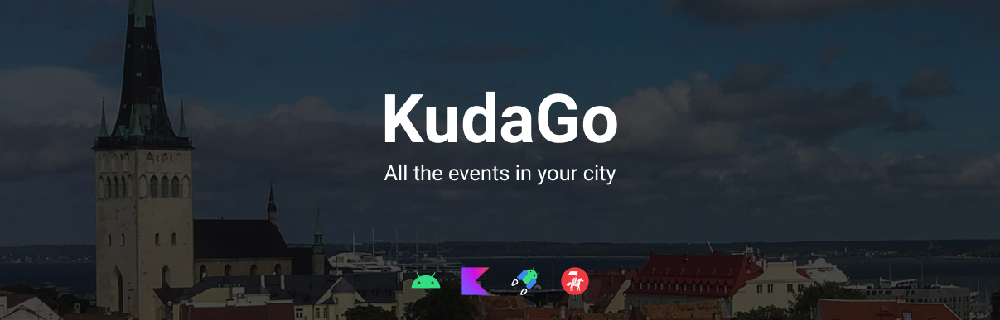

# KudaGo

A simple app with events in a picked city. It was my first
Android app (you can check it on `v1` branch) but I wanted to
update it and develop it with modern stack!

## Stack

- Kotlin
- Coroutines & Flows
- Paging Library 3
- Dagger 2
- Retrofit
- View Binding
- Material Design (+dark theme)

## Data source

I used KudaGo API for list of events,
events details and list of cities. You can check
it out [right there](https://docs.kudago.com/api/)

## Screenshots

// WIP
